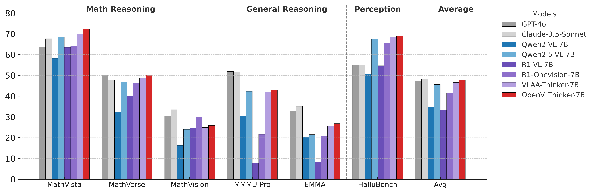

<div align="center">

<h1>OpenVLThinker: Complex Vision-Language Reasoning via Iterative SFT-RL Cycles</h1>

<p align="center">
  <a href="https://huggingface.co/collections/ydeng9/openvlthinker-v12-models-686f4632c23b59379c475169">🤗Models</a> • <a href="https://huggingface.co/collections/ydeng9/openvlthinker-v12-datasets-686f45e48d02e00b1585299e">🤗Data</a> • <a href="https://arxiv.org/abs/2503.17352">📄Paper</a>
</p>

</div>

We maintain our initially released model here: [Legacy model: OpenVLThinker-v1.0](https://huggingface.co/ydeng9/OpenVLThinker-7B), with our initial exploratory [blog](https://yihe-deng.notion.site/openvlthinker).

Authors: [Yihe Deng](https://yihe-deng.notion.site/yihe-deng-main), [Hritik Bansal](https://sites.google.com/view/hbansal), [Fan Yin](https://fanyin3639.github.io/), [Nanyun Peng](https://violetpeng.github.io/), [Wei Wang](https://web.cs.ucla.edu/~weiwang/), [Kai-Wei Chang](https://web.cs.ucla.edu/~kwchang/)

Our study investigates whether R1-like reasoning capabilities can be successfully integrated into large vision-language models (LVLMs) and assesses their impact on challenging multimodal reasoning tasks. We consider an approach that iteratively leverages supervised fine-tuning (SFT) on lightweight training data and Reinforcement Learning (RL) to further improve model generalization. 

As an early result, we present OpenVLThinker, a LVLM exhibiting consistently improved reasoning performance on challenging benchmarks such as MathVista, MathVerse, and MathVision.

<p align="center">

</p>

## Training

OpenVLThinker is iteratively trained in two main stages: Supervised Fine-Tuning (SFT) followed by Reinforcement Learning (RL). The instructions for replicating the training process are located in their respective subdirectories.

### 1. Supervised Fine-Tuning (SFT)

This process is managed using the LLaMA-Factory framework. For complete setup and training instructions, please refer to the SFT README:
**➡️ [SFT Training Instructions](./train/llama-factory/README.md)**

### 2. Reinforcement Learning (RL)

This process is based on the EasyR1 framework. For detailed steps on running the two-stage RL training, please see the RL README:
**➡️ [RL Training Instructions](./train/easyr1/README.md)**

## Evaluation

Our model has been evaluated on several challenging benchmarks:

- Math reasoning: MathVista, MathVerse, MathVision
- General reasoning: MMMU-Pro, EMMA
- Perception: HallusionBench

<p align="center">

</p>

Necessary packages
```bash
pip install qwen_vl_utils
pip install mathruler
```

### Configure 

Before running the evaluation, you need to configure the path to the model checkpoint you wish to evaluate.

Open the evaluation script at [`evaluation/run_evaluation.py`](evaluation/run_evaluation.py) and locate the `get_model_eval_config` function. Update the model_name for the model you are testing. For example, we provided code to evaluate `OpenVLThinker-7B-v1.2`:

```python
# In evaluation/run_evaluation.py

def get_model_eval_config(model_type: ModelType) -> ModelEvaluationConfig:
    """Returns the specific configuration for a given model type."""
    configs = {
        ModelType.OPENVLTHINKER: ModelEvaluationConfig(
            # ==> UPDATE THIS LINE with your model path <==
            model_name="ydeng9/OpenVLThinker-v1.2", 
            processor_name="Qwen/Qwen2.5-VL-3B-Instruct",
            prompt_suffix=""
        ),
        ModelType.QWEN: ModelEvaluationConfig(
            model_name="Qwen/Qwen2.5-VL-7B-Instruct",
            processor_name="Qwen/Qwen2.5-VL-7B-Instruct",
            prompt_suffix="\n\nYour final answer MUST BE put in \\boxed{}"
        )
    }
    return configs[model_type]
```

### Run Evaluation

Use the unified script `run_evaluation.py` for all evaluations. The script automatically handles the correct answer extraction logic (`<answer>` vs. `\boxed{}`) based on the --model argument.

To evaluate OpenVLThinker:

```bash
python evaluation/run_evaluation.py --model openvlthinker --dataset mathvista
```

To evaluate the base Qwen2.5-VL model:

```bash
python evaluation/run_evaluation.py --model qwen --dataset mathvista
```

An optional `--cuda` argument can be used to specify the GPU device (e.g., `--cuda 0`). The evaluation results, including a detailed JSON report, will be saved in the `./evaluation/outputs` directory.

### Special Case: MathVerse Evaluation

Due to the free-form nature of the MathVerse benchmark, we use GPT-4V to verify the model's responses. After generating the output file with the command above, run the verification script:

```bash
python evaluation/verify_mathverse_gpt4.py \
    --responses_file ./evaluation/outputs/mathverse_OpenVLThinker-v1.2.json 
```

**Note**: This requires an OPENAI_API_KEY to be set in your environment variables.

## Citation
```text
@misc{deng2025openvlthinker,
      title={OpenVLThinker: An Early Exploration to Complex Vision-Language Reasoning via Iterative Self-Improvement}, 
      author={Yihe Deng and Hritik Bansal and Fan Yin and Nanyun Peng and Wei Wang and Kai-Wei Chang},
      year={2025},
      eprint={2503.17352},
      archivePrefix={arXiv},
      primaryClass={cs.CV},
      url={https://arxiv.org/abs/2503.17352}, 
}
```

## Acknowledgments

We thank [LLaMA-Factory](https://github.com/hiyouga/LLaMA-Factory) and [EasyR1](https://github.com/hiyouga/EasyR1) for open-sourcing the model training frameworks that we used in this work.