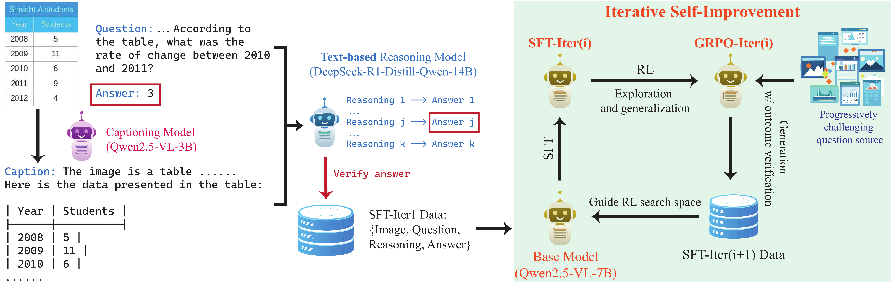
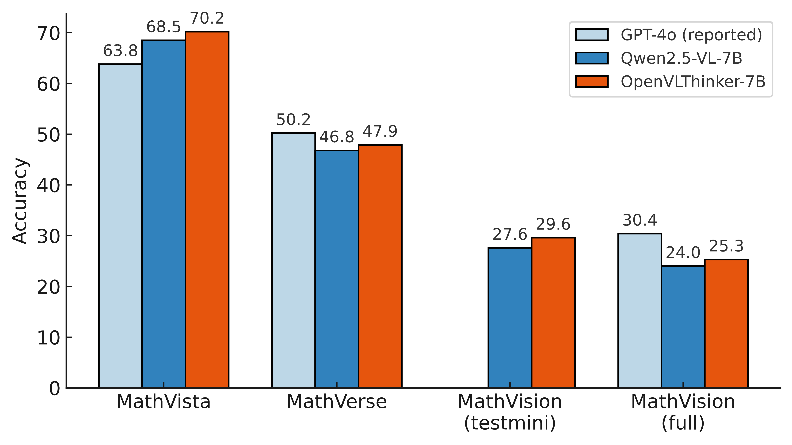

<div align="center">

<h1>OpenVLThinker: An Early Exploration to Vision-Language Reasoning via Iterative Self-Improvement</h1>

<p align="center">
  <a href="https://huggingface.co/ydeng9/OpenVLThinker-7B">🤗Model</a> • <a href="https://yihe-deng.notion.site/openvlthinker">📝Blog</a>
</p>

</div>

Authors: [Yihe Deng](https://yihe-deng.notion.site/yihe-deng-main), [Hritik Bansal](https://sites.google.com/view/hbansal), [Fan Yin](https://fanyin3639.github.io/), [Nanyun Peng](https://violetpeng.github.io/), [Wei Wang](https://web.cs.ucla.edu/~weiwang/), [Kai-Wei Chang](https://web.cs.ucla.edu/~kwchang/)

Our study investigates whether R1-like reasoning capabilities can be successfully integrated into large vision-language models (LVLMs) and assesses their impact on challenging multimodal reasoning tasks. We consider an approach that iteratively leverages supervised fine-tuning (SFT) on lightweight training data and Reinforcement Learning (RL) to further improve model generalization. 

As an early result, we present OpenVLThinker, a LVLM exhibiting consistently improved reasoning performance on challenging benchmarks such as MathVista, MathVerse, and MathVision.

📄 **Paper**: A preview of the paper is provided [here](./paper/OpenVLThinker_report.pdf) 

<p align="center">

</p>

## Evaluation

Our model has been evaluated on several challenging benchmarks:

- MathVista
- MathVerse
- MathVision

<p align="center">

</p>

We provide two evaluation scripts to handle different answer formats:

1. For OpenVLThinker evaluation:
```bash
python evaluation/eval_openvlthinker.py --dataset mathvista
```

2. For Qwen2.5-VL evaluation:
```bash
python evaluation/eval_qwen.py --dataset mathvista
```

The scripts differ in how they handle answer extraction:
- `eval_openvlthinker.py` expects answers in the format `<answer>...</answer>`
- `eval_qwen.py` expects answers in the format `\boxed{...}`

For MathVerse evaluation, we need to verify the model's responses using GPT-4V due to the more diverse response formats in its free-form questions:
```bash
python evaluation/verify_mathverse_gpt4.py \
    --responses_file ./evaluation/outputs/mathverse_OpenVLThinker-7B.json \
    --output_dir ./evaluation/outputs
```
Note: This requires an OpenAI API key to be set in your environment variables.

Optional arguments for both evaluation scripts:
- `--cuda`: Specify CUDA device number (default: 0)
- `--model_path`: Path to the model (default: "ydeng9/OpenVLThinker-7B" for OpenVLThinker, "Qwen/Qwen2.5-VL-7B-Instruct" for Qwen)

The evaluation results will be saved in the `./evaluation/outputs` directory. **Note**: evaluation results may fluctuate on different GPUs.

Our detailed evaluation results are listed below

| Benchmark | GPT-4o (reported) | Qwen2.5-VL-7B | OpenVLThinker-7B |
|-----------|------------------|---------------|------------------|
| MathVista | 63.8 | 68.5 | **70.2** |
| MathVerse | 50.2 | 46.8 | **47.9** |
| MathVision (testmini) | - | 27.6 | **29.6** |
| MathVision (full) | 30.4 | 24.0 | **25.3** |

*Table 1: Evaluation results across multi-modal reasoning benchmarks including MathVista, MathVerse and MathVision. We include the reported performance of GPT-4o as a reference. OpenVLThinker-7B consistently and effectively improves upon the performance of Qwen2.5-VL-7B, surpassing or matching the performance of GPT-4o.*

## Acknowledgments

We thank [LLaMA-Factory](https://github.com/hiyouga/LLaMA-Factory) and [EasyR1](https://github.com/hiyouga/EasyR1) for open-sourcing the model training frameworks that we used in this work.